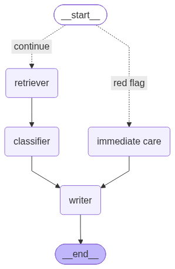

# 🏥 ED Triage Chatbot

An AI-powered Emergency Department triage decision-support tool that classifies patient presentations into Emergency Severity Index (ESI) levels using a multi-layer agentic pipeline.

---

## 📌 Project Overview

Emergency Department triage nurses must rapidly assess incoming patients and assign an ESI level (1–5) that determines the urgency and allocation of clinical resources. This chatbot assists that process by accepting a **patient vignette** (a short clinical narrative describing the patient's symptoms and presentation) and returning a structured triage assessment.

The system uses a **three-layer pipeline** built with LangGraph:

1. **⚡ Red-Flag Interceptor** — A fast, pure-Python rule-based safety check. If the vignette contains critical keywords (e.g., cardiac arrest, massive hemorrhage, unresponsive), the patient is immediately assigned **ESI Level 1** without waiting for the LLM, ensuring no life-threatening case is missed.

2. **📚 ChromaDB RAG Retriever** — For non-Level-1 cases, the system queries a local ChromaDB vector store built from the *ESI Handbook (5th Edition)*. This retrieves the most relevant clinical guidelines to ground the LLM's reasoning and reduce hallucination.

3. **🧠 Groq LLM Classifier** — The retrieved ESI context and patient vignette are passed to a Groq-hosted LLM, which uses structured output to produce a complete `TriageAssessment`: ESI level (2–5), urgency label, estimated resource count, clinical reasoning, and recommended action.

Results are displayed in the Chainlit chat UI and also saved as text files in `scripts/output_files/`.

### Workflow Graph



---

## 🛠️ Tech Stack

| Component | Technology |
|---|---|
| UI | [Chainlit](https://docs.chainlit.io/) |
| Agentic workflow | [LangGraph](https://langchain-ai.github.io/langgraph/) |
| LLM | Groq (LLaMA-3.3-70B / GPT-OSS-120B) |
| Vector store | ChromaDB |
| Embeddings | HuggingFace `BAAI/bge-large-en-v1.5` |
| ESI Knowledge Base | ESI Handbook 5th Edition (PDF → ChromaDB) |

---

## 🚀 How to Run

### 1. Install dependencies

```bash
pip install -r requirements.txt
```

### 2. Set up environment variables

Create a `.env` file in the project root with your API keys:

```
GROQ_API_KEY=your_groq_api_key_here
```

### 3. Launch the Chainlit app

From the project root, run:

```bash
chainlit run scripts/app.py
```

The app will open in your browser at `http://localhost:8000`.

---

## 💬 How to Use

Once the app is running, you can test it in two ways:

- **Quick-test buttons** — Click one of the pre-loaded sample buttons in the chat UI (Level 1 chest pain, Level 3 abdominal pain, or Level 5 skin rash).
- **Custom vignette** — Type or paste any patient vignette text directly into the chat box.

---

## 📋 Example Vignettes (from `scripts/ed_triage_vignettes_500_enriched.csv`)

The dataset contains 500 patient vignettes across all 5 ESI levels. Here are examples you can copy and paste directly into the chat:

### 🔴 ESI Level 1 — Immediate (Life-Saving Intervention Required)
> *57-year-old male presents with Cardiac arrest. Patient appears critically ill. Immediate intervention required. Airway assessed, vitals unstable.*

> *35-year-old female presents with Unresponsive. Patient appears critically ill. Immediate intervention required. Airway assessed, vitals unstable.*

> *82-year-old female presents with Severe respiratory distress. Patient appears critically ill. Immediate intervention required. Airway assessed, vitals unstable.*

---

### 🟠 ESI Level 2 — Emergent (High-Risk, Rapid Evaluation Needed)
> *69-year-old female presents with Severe shortness of breath. Patient in moderate distress. Rapid assessment indicates emergent condition. Vital signs concerning.*

---

### 🟡 ESI Level 3 — Urgent (Multiple Resources Expected)
> *42-year-old male presents with Back pain. Patient alert and oriented. Moderate discomfort noted. Full workup planned.*

---

### 🟢 ESI Level 4 — Less Urgent (One Resource Expected)
> *47-year-old female presents with Cough. Patient stable, minimal distress. Routine evaluation indicated.*

---

### 🔵 ESI Level 5 — Non-Urgent (No Resources Expected)
> *88-year-old male presents with a minor rash. Patient ambulatory and comfortable, with stable vital signs.*

---

## ⚠️ Disclaimer

This tool is intended for **educational and research purposes only**. It is not a substitute for clinical judgment by a licensed healthcare professional.
